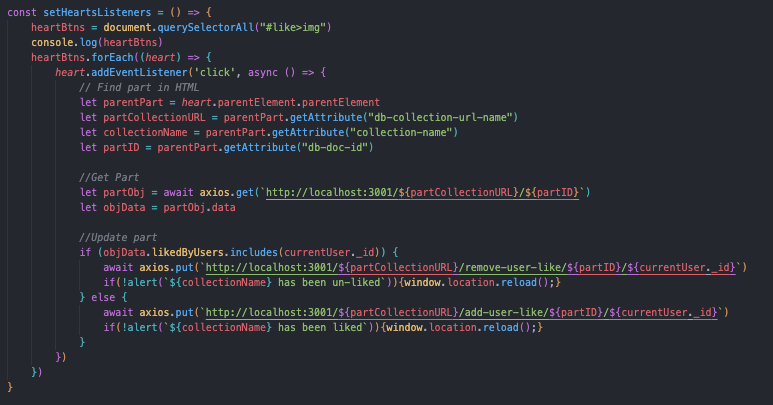

# Family-Bike-Build-Network

This app will allow families who want to schlep their kids on bikes get inspiration for builds and parts to make the journey on any budget. It will feature community builds and user-submitted bikes and parts. Mongo/Mongoose/Express/Node, vanilla JS/HTML/CSS

# Functionality

## Overview

This site has four major functions, including:
1. Viewing and liking community-submitted parts (community parts)
2. Viewing and liking community-submitted builds (community builds)
3. Adding a user-submitted part to the parts catalog
4. Configuring a user-subitted build from existing parts in the parts catalog

**Parts** come in six categories, including:
- Bikes
- Seats
- Trailers
- Racks
- Storage
- Other Accessories (lights, locks, tie-downs, etc.)

Each part has user-submitted content, including Brand, Model, Product Link, Picture, and other part-specific data.

**Builds** consist of any combination of Parts, plus a user-submitted display name, build notes, and picture.

**User Likes** for Parts and Builds are shown and tallied on the Community Pages

## Functionality Backlog
- User and User Profile
    - Add User authentication
    - Add User Profile page, including the ability to view and edit your submitted build
    - Show User Profile Picture and Name on each header, persisting 
    - View other's user profiles
    - Add Admin-Only functionality, including:
        - Editing and deleting parts and builds (content moderation)
        - Editing and deleting user data (content modaration)
- Community Parts and Builds
    - **(Next Release)** See pop-up Part and Build details when clicking on summary cards
    - Search and Filter by Keyword
    - **(Next Release)** Show placeholder picture when none is available
    - Add Reviews/Ratings for Parts
    - (Vanilla JS/HTML/CSS limitation) Toggle HTML changes upon clicking "like" without reloading the page -> send DB query and then make manual HTML change via JS.
    - Upload user pictures to DB (instead of URL links)
- Build Cart
    -  Add part count and just part quantity (instead of duplicate parts)
    - **(Next Release)** “Please select a part from community parts” link if cart is empty
    - Improved validation (e.g., must include at least 1 bike)
- Add-Part 
    - **(Priority)** Build out remaining 5 Add Part collections
- Homepage
    - Add "feed" of recent activities and community highlights
- In general
    - Add responsive design elements (mobile optimized), including hampurger menus for headers
    - **(Next Release)** Formatting and position cleanup (especially related to the parts renderer)
    - Add images and accents to front-end, especially homepage and add-parts

# Technical Notes

## Wireframe

The wireframe was used for three parallel purposes:
1. Mock up layout and styles
2. Facilitate gap-assessment of UX and functionality design
3. Facilitate back-end planning, including a list of CRUD functions for each page

## Entity Relationship Diagram (ERD)

This application has 3 major relationship types and 8 collections:
1. **Users** hold buildCarts consisting of **Parts**
2. **Completed Builds** hold **Parts** and **Users**
3. **Parts** hold **Users**

**Parts** all behave identically against Users and Completed Builds, and do not related to each other. They include unique schemas for:
1. Bikes
2. Seats
3. Trailers
4. Racks
5. Storage
6. Accessories

**Entity Relationship Diagram Snippet**

## Code Highlights

#### Render all parts and listeners from multiple DB collections
- Nested functions
- Switch Statement
- Repeatable approach - also used for Community Builds

#### Like Buttons that toggle
- ".parentElement" to access parent div data (e.g., DB ID embedded in part container)
- Multiple DB calls based on object conditions

#### Styling for Dynamically Generated Part Container
- CSS Grid with named area-templates
- Nested Grids

#### Submit Part Form
I got it to work!

## Links
- Entity Relationship Diagram (ERD) - https://lucid.app/lucidchart/ea347656-cb9a-4fc7-89a6-68f42a5ed6c8/edit?view_items=ycsD_re2YN0G&invitationId=inv_487a8e67-1008-42ec-a90f-84b79b1155f8
- Wireframes - https://www.figma.com/file/vkIyKUn0qOH81tWso0Tio6/Family-Bike-Builder-Network?type=whiteboard&node-id=0%3A1&t=CvdrRYbafAFo8OXs-1
- Requirements, Build Plans, Seed Psuedo Code, and Detailed Backlog - https://docs.google.com/document/d/1gkzndnmorJpVkG3G0X_7Rga1NVe13QmK1Iljots7O4w/edit?usp=sharing

## Sources and Attribution
<!-- - Header Clipart - https://www.freepik.com/premium-vector/colorful-illustration-cartoon-bike-trailers-kids_13504215.htm -->
- Color Palette - https://paletton.com/#uid=53L0u0kllllaFw0g0qFqFg0w0aF
- Filter HTML/CSS - https://codepen.io/edlinkiii/pen/XWPrweQ
- Search Bar HTML/CSS - https://codepen.io/huange/pen/bGqMqM
- Nav-Bar HTML and Styling - [Darcy Struble](https://github.com/darcystruble)
- Form Submission Example - [Billy Rogers](https://github.com/williamrogerschi)
- Thanks to the SEIR 0911 social room and instructors for a wide range of aesthetic and debugging input!

# Reflection

## **What went well?**
- Planning paid off - minimal deviation from wireframe and ERD completed in the first day of the project
- DB and back-end implementation went smoothly, as designed
- Much quicker on setting up front-end template/styling, including Grid
- Learned some cool coding tidbits, including:
    - Use a single "Model.create()" method instead of "new Model()" -> "Model.save()"
    - All DB queries/controllers require "res.send()" even if the output is not returned to the front end. Otherwise the query will never resolve!
    - In MongoDB schemas, empty Strings default to `""` (which is a valid string) while empty Numbers default to `null`(which is not a valid number and has to be treated with conditionals on the script).
- Towards the end of the week, I was comfortable enough with my code to build the Add Parts functionality and UI (and learn forms) from scratch in one afternoon.

## **Different for next time**
- Need to better plan breaks in my day. I was inefficient in debugging for longer stretches than I wanted.
- There was a lot of copy/paste repetition on the 6 Part collections. I should have trimmed down Part collections and repurposed time for more/different functionality.
- I spent too much time battling against the limitations of vanilla JS. I wish I had explored user authentication or filter/search instead of the Like buttons.
- For future exploration - Could/should I created a single "Part" schema with all of the configuration on the front end? The backend is highly repetitious, and the only difference in schemas shows up in an unimplemented part detail modal.
- Need to get better at [MVP vs SLC](https://www.bluent.net/blog/mvp-vs-slc/#:~:text=Viable%20vs.,-Lovable&text=SLC's%20'Lovable'%20concept%20calls%20for,use%20or%20interest%20with%20it.). What is "good enough" from a functionality standpoint is not necessarily the minumum of what the user wants.

